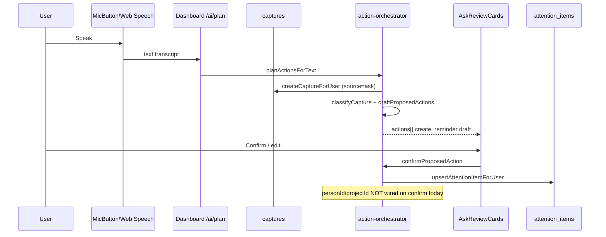

# Voice First — Current State Assessment

**Product:** Recall (repo may still say “Aura”)  
**Date:** 2026-07-30  
**Milestone:** 1 (assessment only — no Voice First code changes)  
**Production:** https://recall-app.net

---

## 1. Current architecture

Recall is a pnpm monorepo with an evidence-first, capture-first personal OS:

```text
Input (type / mic dictation / share / extension / connectors)
  → captures (immutable raw) + optional ask_threads
  → jobs (capture_extraction, attention_scan, waiting_scan, …)
  → AI classify / extract (OpenAI) → capture_items / attention / waiting
  → user confirm (Inbox / AskReviewCards / Deadlines)
  → domain writes (tasks, notes, attention_items, people, projects)
  → Today / Ask / Deadlines / People / Projects UI
```

Six documented layers (see `docs/01_Architecture.md`): Capture → Normalization → AI Extraction → Evidence → Query & Reasoning → UI.

### Stack (verified)

| Layer | Technology |
|-------|------------|
| Frontend | React 19, Vite 7, wouter, Tailwind 4, PWA |
| API | Express 5, Pino |
| DB | PostgreSQL + Drizzle ORM |
| Jobs | `jobs` table + PM2 `recall-worker` poller |
| AI | OpenAI only (`AiService` interface; `DisabledAiService` fallback) |
| Auth | Cookie JWT sessions; extension Bearer for `POST /captures` |
| Tests | Vitest (api-server), Playwright e2e |
| Deploy | GitHub Actions → DigitalOcean → nginx + PM2 |

### Relevant directories

| Path | Role |
|------|------|
| `artifacts/api-server/` | API, AI, jobs, connectors |
| `artifacts/recall-app/` | Primary SPA |
| `artifacts/recall-extension/` | Browser capture extension |
| `lib/db/` | Schema + SQL migrations |
| `lib/api-spec/` | OpenAPI / Orval |
| `docs/` | Engineering playbook |
| `e2e/` | Playwright smoke |

---

## 2. Existing voice / AI functionality

### Voice input (exists, client-only)

| Piece | Path | Behavior |
|-------|------|----------|
| Web Speech STT | `recall-app/src/hooks/use-speech-input.ts` | One-shot browser recognition → final text |
| Mic support | `recall-app/src/lib/speech-support.ts` | Permission + **blocks iOS standalone PWA** |
| Mic UI | `recall-app/src/components/MicButton.tsx` | Used on Ask, Capture modal, Today brain dump, Notes, Tasks |

**Critical:** Voice today is **dictation into text fields**. No `MediaRecorder`, no audio upload, no server STT (Whisper/Deepgram/etc.).

### Voice output (partially wired)

| Piece | Path | Status |
|-------|------|--------|
| OpenAI TTS | `api-server/src/services/tts.ts`, `POST /ai/tts` | Works |
| Browser TTS fallback | `recall-app/src/lib/speech-synthesis.ts` | Works |
| Preference | `localStorage` key `recall.voiceAnswers` | Default on |
| Auto-speak hook | `recall-app/src/hooks/use-speak-answer.ts` | **Implemented but not mounted in Ask UI** — Dashboard only calls `stopSpeaking()` |

### Conversational AI (strong reuse)

| Piece | Path |
|-------|------|
| Ask plan/confirm | `POST /ai/plan` → `planActionsForText`; `POST /ai/actions/confirm` → `confirmProposedAction` |
| Orchestrator | `api-server/src/services/action-orchestrator.ts` |
| Intent router | `intent-router.ts` + `classifyIntent.v1` (regex fast-path includes “remind me”) |
| Capture classify | `classifyCapture.v2` (person, project, due date, types) |
| Query engine | `query-engine.ts` + deterministic handlers + grounded LLM |
| Threads | `ask_threads` / `ask_messages` (durable multi-turn) |
| Review UI | `AskReviewCards.tsx` |
| Streaming | `POST /ai/query/stream` exists; Ask UI uses plan path, not stream |

### Capture pipeline (already universal for text)

```text
POST /captures → ingestCaptureForUser → createCaptureForUser
  → enqueue capture_extraction → classifyCapture
  → capture_items (+ optional attention / waiting / auto-accept)
  → Inbox accept/dismiss
```

Offline: `ingestCaptureReliable` + localStorage queue.  
PWA share target → Today prefill.  
Extension → same `/captures` endpoint.

---

## 3. Current data flow (Ask reminder example)



---

## 4. Existing domain entities (vertical-slice ready)

| Entity | Schema | Service | Voice First use |
|--------|--------|---------|-----------------|
| Raw capture | `captures` | `captures.ts` | Canonical utterance / provenance |
| Inbox item | `capture_items` | `capture-items.ts` | Low-confidence review queue |
| Task | `tasks` | `tasks.ts` | `create_task` |
| Reminder/deadline | `attention_items` | `attention.ts` | `create_reminder` (preferred for “remind me”) |
| Note | `notes` | `notes.ts` | `create_note` |
| Person | `people` | `people.ts` | Resolve “John” |
| Project | `projects` | `projects.ts` | Resolve “Smith project” |
| Waiting | `waiting_items` | `waiting-items.ts` | Follow-ups (later slice) |
| Entity links | `entity_links` | `entity-links.ts` | Relationships |
| Ask thread | `ask_threads` | `ask-threads.ts` | Conversation session |
| Audit | `audit_log` | `audit.ts` | Provenance of actions |
| User prefs | `users.timezone` + briefing cols | `notification-settings.ts` | Relative time |

**Do not create parallel task/reminder/memory stores.** Map Voice First actions onto these services.

---

## 5. Testing capabilities

| Suite | Command | Baseline (2026-07-30) |
|-------|---------|------------------------|
| API typecheck | `pnpm --filter @workspace/api-server run typecheck` | **Pass** |
| Frontend typecheck | `PORT=5173 BASE_PATH=/ pnpm --filter @workspace/recall-app run typecheck` | **Pass** |
| API unit/integration | `vitest run` in api-server (prefer `--maxWorkers=2 --minWorkers=1`) | **504/504 pass** |
| Frontend build | `PORT=5173 BASE_PATH=/ pnpm --filter @workspace/recall-app run build` | **Pass** (chunk-size warning only) |
| E2E | Playwright in `e2e/` (CI vs production) | Not re-run in Milestone 1 |

Known flake: under high parallel worker counts, some `*.db.test.ts` PGlite migration tests can time out. Sequential/low-worker runs are green. Deploy excludes `*.db.test.ts` on the droplet.

Action-orchestrator, intent-router, capture-classify, attention, and briefing already have focused unit tests — good templates for Voice First golden tests.

---

## 6. Reusable components (prefer these)

1. **`planActionsForText` / `confirmProposedAction`** — already the conversational write path  
2. **`captures` + job extraction** — already the universal text capture pipeline  
3. **`MicButton` + `useSpeechInput`** — already speech → text  
4. **`AskReviewCards`** — already proposal/confirm/edit UX  
5. **`upsertAttentionItemForUser`** — already reminders on Today/Deadlines  
6. **`resolveCaptureLinks` / `matchPersonId` / link-suggestions** — entity resolution patterns  
7. **`ask_threads`** — conversation memory across turns  
8. **`writeAuditLog`** — action audit trail  
9. **`AiService` interface + prompt version constants** — provider/version discipline  
10. **`users.timezone` / `isoDateInTimezone` / `dueAtFromDateString`** — time helpers (extend, don’t replace)

---

## 7. Architectural limitations

| Limitation | Impact on Voice First |
|------------|------------------------|
| No server STT / audio storage | Continuous / wearable / iOS-PWA voice needs new adapter later |
| Action proposals are **stateless drafts** returned to the client | No durable `ActionProposal` row, weaker idempotency/audit of “proposed vs confirmed” |
| Ask confirm does not apply person/project links | “Call John… Smith project” extracts names but may not link on execute |
| Relative time is coarse | “Tomorrow morning” → date-ish; no preference-based morning hour yet |
| TTS auto-speak not mounted | Spoken completion UX incomplete |
| No feature-flag system | Rollout will need a minimal flag (env or user setting) |
| No token/cost metrics | Observability gap for model routing |
| OpenAI hard-coded behind `AiService` | Adapter OK; second STT provider still net-new |
| iOS PWA mic blocked | Mobile voice on home-screen install needs alternate STT |
| Corrections mid-conversation | Threads exist; correction-vs-new-request policy not first-class |

---

## 8. Privacy and security concerns

Already strong:

- Per-user scoping on all domain services (`eq(userId, …)`)
- Capture auth for extension tokens
- Audit log for major mutations
- Pino redacts auth headers
- Capture-first: raw source preserved before AI

Gaps for Voice First:

- No audio retention policy (because no audio yet) — define **before** adding upload
- Transcripts must not enter analytics/logs by default
- Prompt injection already a concern for captures; confirmation policy must remain server-side
- TTS requests send answer text to OpenAI — same privacy boundary as Ask answers today
- Deletion story for audio+transcript+derived entities needs design when audio lands

---

## 9. Recommended integration points

| Concern | Integrate here (not a new silo) |
|---------|----------------------------------|
| Conversational capture | Extend `action-orchestrator` + `/ai/plan` |
| Typed + spoken text | Same pipeline after STT → text |
| Reminder execution | `upsertAttentionItemForUser` |
| Task execution | `createTaskForUser` |
| Entity resolution | Extract shared helper from `capture-classify` / `link-suggestions` |
| Conversation session | `ask_threads` (optionally add session metadata) |
| Confirm UI | Evolve `AskReviewCards` + optional Today talk control |
| Async heavy work | Existing `jobs` queue |
| Audit | `writeAuditLog` with new action labels |
| Voice module boundary | New `api-server/src/services/voice-first/` **adapters + orchestration wrappers** that call existing services |

---

## 10. Pre-existing test / build failures

Recorded at Milestone 1 baseline (2026-07-30):

| Check | Result |
|-------|--------|
| API typecheck | Pass |
| Frontend typecheck | Pass |
| API vitest (2 workers) | **504 passed / 74 files** |
| Frontend build | Pass (large-chunk warning only) |
| Lint | No dedicated root lint gate beyond typecheck in CI |

**No blocking pre-existing failures.** Note only: PGlite migration tests can flake under high parallelism — treat as environmental, not Voice First regressions.

---

## 11. Open questions (ask only if they change architecture)

See Milestone 1 handoff. Non-blocking assumptions are documented in `08-implementation-log.md`.

Material ones:

1. Reminder default for “morning” / “evening” (clock time)?  
2. Auto-execute low-risk reminders after spoken confirm vs always tap Confirm?  
3. Is browser Web Speech enough for Milestone 3, or must server STT ship in the first vertical slice?  
4. Should Voice First live primarily on `/ask`, Today, or a new talk surface?

---

## 12. Gap analysis (current → Voice First vision)

| Vision principle | Today | Gap size |
|------------------|-------|----------|
| Conversation as primary interface | Ask + Capture exist; Today is proactive hub | **Medium** — elevate talk UX, don’t replace Today |
| Natural speech | Browser dictation only | **Small** for vertical slice; **Large** for wearables |
| One capture pipeline | Text/share/extension unified | **Small** — route voice transcripts into same path |
| Structured knowledge from unstructured | classifyCapture + orchestrator | **Small–Medium** — harden schema + entity link on confirm |
| Interrupt / correct | Threads + edit cards | **Medium** — explicit correction intents |
| Never ask for known info | Partial | **Medium** — better context retrieval before clarify |
| Distinguish suggestion vs done | AskReviewCards | **Small** — already present; wire spoken status |
| Confirmation for risky actions | All Ask writes confirm today | **Small** — add risk tiers + durable proposals |
| Event-driven, not continuous AI | Jobs + on-demand classify | **Aligned** |
| Observable cost/latency | Minimal | **Medium** |
| Future channels (earbuds, car) | Not started | **Large** — design adapters now, implement later |

**Bottom line:** Recall is closer to Voice First than a greenfield app. The missing piece is not “another AI chat” — it is a thin Voice First boundary that (1) treats speech as first-class capture into the **existing** plan/confirm/attention path, (2) durably tracks proposals, (3) resolves people/projects on execute, and (4) speaks status clearly — without duplicating tasks, reminders, or capture tables.
