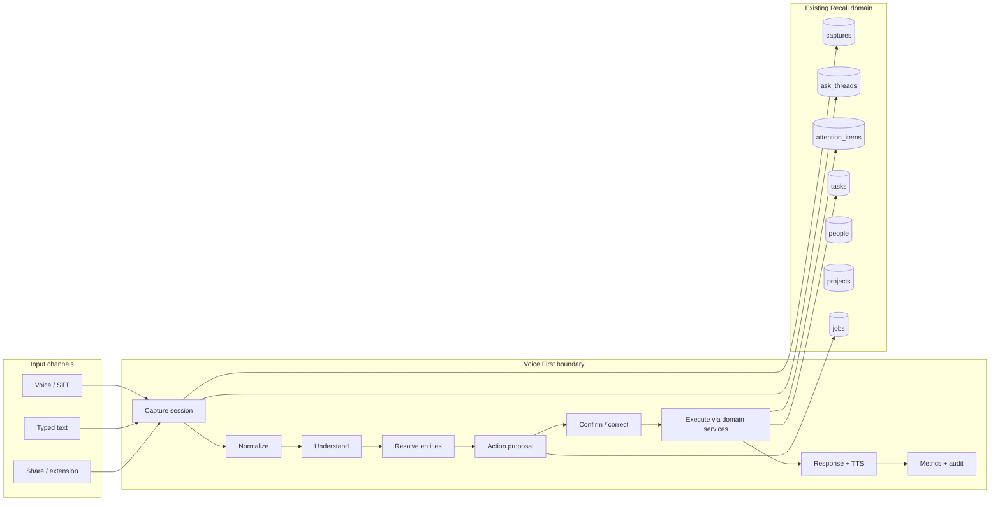

# Voice First — Target Architecture (Reconciled with Recall)

**Date:** 2026-07-30  
**Milestone:** 1  
**Principle:** Reuse existing domain models. Introduce adapters and durable proposal state; do not create parallel task/reminder/capture systems.

---

## 1. Design thesis

Voice First is an **input/output and orchestration layer** on top of Recall’s existing capture → classify → confirm → domain-write stack.



---

## 2. Universal capture pipeline

**Canonical entry (conceptual):** any channel produces a capture that is already represented by `captures` + optional `ask_threads` turn.

| Conceptual field | Existing mapping |
|------------------|------------------|
| `CaptureInput.id` | `captures.id` |
| `userId` | `captures.userId` |
| `sessionId` | `ask_threads.id` (conversation) |
| `source` | `captures.sourceType` (`ask`, `manual`, `browser_extension`, …) + new `voice` when audio lands |
| `rawText` | `captures.rawText` |
| `audioReference` | **New optional column or object-storage key** (Milestone 3+ only) |
| `clientTimestamp` / `serverTimestamp` | `createdAt` + metadata |
| `timezone` | `users.timezone` ?? `RECALL_TIMEZONE` |
| `locale` / `deviceContext` | `rawMetadata` |
| Idempotency key | New metadata / dedicated column on capture or proposal |

**Statuses (pipeline view)** — map onto existing `captures.processedStatus` + proposal status rather than inventing a second lifecycle:

| Voice First status | Implementation |
|--------------------|----------------|
| `received` | Capture created |
| `transcribing` | Only when audio present (new) |
| `understanding` | classifyCapture / intent route in flight |
| `awaiting_confirmation` | Durable proposal `proposed` |
| `executing` | Confirm handler running |
| `completed` | Domain write + audit |
| `failed` / `cancelled` | Existing failed + new cancelled proposal |

Typed text enters **immediately** through the same path as today’s `/ai/plan` (preserve UX; gradually make proposals durable).

---

## 3. Conversation session model

**Reuse `ask_threads` / `ask_messages`.**

Extend (minimally, later milestones):

- Thread metadata: `activeProposalId`, `lastVoiceMode`, client timezone at session start  
- Turns already support user/assistant roles and retrieval of recent history  

**Do not** create a parallel `conversation_sessions` table unless thread metadata proves insufficient.

Conceptual `ConversationTurn` ↔ `ask_messages` row (+ link to `captures.id` in metadata when the turn was a capture).

---

## 4. Event model

Event-driven via existing patterns:

| Event | Mechanism |
|-------|-----------|
| Capture received | Row insert + audit `capture_created` / `ask_input_planned` |
| Extraction needed | `jobs` type `capture_extraction` |
| Proposal ready | Durable proposal row (new) + optional SSE/poll |
| Confirmed / cancelled | Audit + proposal status transition |
| Executed | Domain write + audit `ask_action_confirmed` (extend labels) |

Avoid continuous model polling. Models run on user events and job workers only.

---

## 5. Memory model

Recall already has structured memory (`life_memories`), notes, tasks, attention, waiting, people, projects, entity_links.

| Conceptual | Reuse |
|------------|-------|
| `MemoryRecord` | Prefer existing entity created by the action (task / attention / note / memory) — not a duplicate “voice memory” table |
| Provenance | `sourceCaptureId`, evidence rows, audit log |
| `MemoryRelationship` | `entity_links` |

Voice First stores **understanding artifacts** (prompt version, confidence, ambiguities) on:

- `ai_extractions` (already), and/or  
- proposal metadata, and/or  
- ask_message metadata  

---

## 6. Intent and entity extraction

### Understanding service (provider-independent)

Wrap existing pieces behind a Voice First facade:

1. `routeIntentForText` / `classifyIntent` → primary intent  
2. `classifyCapture` / deterministic extractors → entities, dates  
3. Future: schema-validated Zod output (`create_task` | `create_reminder` | `unknown` first)

**First vertical slice intents only:**

- `create_reminder`  
- `create_task`  
- `unknown` → clarify or Inbox  

### Entity resolution

Shared helper (extract from capture-classify / link-suggestions / people match):

- People: `matchPersonId` + aliases + email  
- Projects: whole-word / name match (same discipline as `mentionedProject`)  
- Unique high confidence → auto-link on proposal  
- Ambiguous → clarification turn  
- None → keep surface text; **never invent** person/project rows from voice alone in v1  

---

## 7. Agent / orchestration layer

**Primary home:** extend `action-orchestrator.ts` and a thin `services/voice-first/` package:

```text
voice-first/
  types.ts                 # CaptureInput-ish types, proposal DTOs
  pipeline.ts              # receive → understand → propose
  providers/
    transcription.ts       # TranscriptionProvider interface
    understanding.ts       # UnderstandingProvider interface (fakeable)
  resolution/
    entities.ts            # people/projects resolve
  policy/
    confirmation.ts        # risk → confirm required?
  temporal/
    resolve.ts             # tomorrow morning + user tz
```

Orchestrator continues to call **only** existing executors (`createTaskForUser`, `upsertAttentionItemForUser`, …).

---

## 8. Action proposal and confirmation

### Gap to close

Today proposals are **ephemeral JSON** returned by `/ai/plan`. Voice First needs **durable proposals** so confirm/correct/idempotency are trustworthy.

### Proposed addition (Milestone 5; schema in later docs)

Minimal table or JSONB store, conceptually:

```text
action_proposals
  id, userId, sessionId (thread), captureId
  actionType, arguments (json), explanation
  confidence, riskLevel, confirmationRequired
  status: proposed | confirmed | executed | cancelled | superseded
  idempotencyKey
  version, supersedesId
  model / promptVersion / schemaVersion
  createdAt, updatedAt
```

### Risk policy (v1)

| Class | Examples | Policy |
|-------|----------|--------|
| Low, reversible | Create personal task/reminder | Confirm once (spoken or tap); optional later auto-exec for high confidence |
| Medium | Link to person/project, save memory | Confirm |
| High | Send email, delete, finance, share externally | Always explicit confirm; out of slice |

### Corrections

Correction utterances update the **active proposal** (new version, previous `superseded`). After execution, use existing patch/dismiss/complete APIs.

---

## 9. Model-routing strategy

Aligned with cost controls:

| Tier | Use |
|------|-----|
| Deterministic | Regex intent fast-path, date parsing, validation, idempotency |
| Small/fast model | classifyIntent, classifyCapture (current `gpt-4.1-mini` default) |
| Larger model | Complex Ask questions only (`queryRecallForUser` path) |
| Batch jobs | Digests, scans — already non-urgent |

Transcription: browser Web Speech for Milestone 3 default; OpenAI Whisper (or equivalent) adapter when audio upload is required (iOS PWA / quality).

---

## 10. Confidence handling

Reuse existing confidence fields; add explicit gates:

- `confidence >= autoLinkThreshold` → attach entity id on proposal  
- `confidence < confirmThreshold` or ambiguous entities → clarification  
- `unknown` intent → no execution  
- Invalid model JSON → reject / safe repair (Zod), never execute  

---

## 11. Observability

Add a small metrics sink (log structured events first; table later if needed):

- Stage latencies (capture, STT, understand, resolve, execute, e2e)  
- Provider / model / promptVersion  
- Tokens when API returns them  
- Outcome: clarified | confirmed | executed | cancelled | failed | duplicate_prevented  
- **Never** log raw transcript/audio by default — ids only  

Wire into existing Pino logger with redaction.

---

## 12. Privacy and retention boundaries

| Asset | Policy (v1) |
|-------|-------------|
| Transcript text | Same as capture `rawText` — user-scoped, not in analytics |
| Audio (when added) | Private storage, TTL configurable, delete with user purge |
| TTS | Same as sending Ask answer text to OpenAI today |
| Training | No personal content for training without explicit opt-in (none today) |

AI output never elevates permissions; executors remain server-validated.

---

## 13. Background processing strategy

| Work | Where |
|------|-------|
| Fast plan for conversational UX | Request path (`/ai/plan`) |
| Heavy extraction / OCR | `jobs` worker |
| Reminder scans / waiting scans | Existing sweeps |
| Voice STT (server) | Sync for short utterances first; async job if long audio |

---

## 14. Extension points (future channels)

```text
TranscriptionProvider.transcribe(audio) → Transcript
SpeechOutputProvider.speak(text) → void   // already nearly exists as TTS
ChannelAdapter.normalize(input) → CaptureInput
```

Future: earbuds, car, watch, glasses = new `ChannelAdapter` + same pipeline. No UI rewrite required for domain logic.

---

## 15. UI strategy (minimal for vertical slice)

Do **not** redesign the app.

Add/adjust only:

1. Prominent talk control (Today and/or Ask — reuse `MicButton`)  
2. Explicit states: Idle / Listening / Processing / Awaiting confirmation / Executing / Done / Failed  
3. Final transcript editable before confirm  
4. Proposal card (evolve `AskReviewCards`)  
5. Correction via voice or text  
6. Optional spoken completion via wiring `useSpeakAnswer`  

Status must never imply completion before server confirm.

---

## 16. Mapping conceptual → existing (anti-duplication)

| Spec concept | Recall reality |
|--------------|----------------|
| CaptureInput | `captures` (+ metadata) |
| ConversationTurn | `ask_messages` |
| UnderstandingResult | classifyCapture + intent + `ai_extractions` |
| ActionProposal | **New durable store** (only net-new core table likely needed) |
| MemoryRecord | tasks / attention_items / notes / life_memories |
| MemoryRelationship | `entity_links` |

---

## 17. Recommended first vertical slice

**Utterance:**  
“Remind me tomorrow morning to call John about the MRI and connect it to the Smith project.”

**Path:**

1. Mic or typed → `/ai/plan` (same capture)  
2. Intent `reminder` / `create_reminder`  
3. Resolve “tomorrow morning” with documented fallback (e.g. 09:00 user tz)  
4. Resolve John / Smith project (clarify if ambiguous)  
5. Durable proposal + confirmation copy  
6. Confirm → `upsertAttentionItemForUser` with `personId` + `projectId`  
7. Evidence + audit + concise response (+ TTS)  
8. Idempotent retry  

**Out of slice:** server STT, wake word, email send, recurring reminders, full evaluation harness (stubs OK).

---

## 18. Milestone sequence (unchanged intent, minimized work)

| Milestone | Focus | Heavy reuse |
|-----------|-------|-------------|
| 1 | Docs + baseline (this) | — |
| 2 | Canonical typed capture through Voice First facade → existing plan | orchestrator, captures |
| 3 | Transcription interface; browser STT already feeds text; optional audio later | MicButton |
| 4 | Structured understanding + entity resolution helpers | classifyCapture, people, projects |
| 5 | Durable proposals + confirm/correct + vertical slice | AskReviewCards, attention |
| 6 | Observability, flags, eval, rollout docs | audit, logger |

Stop for review before any large schema migration or new paid STT provider.
