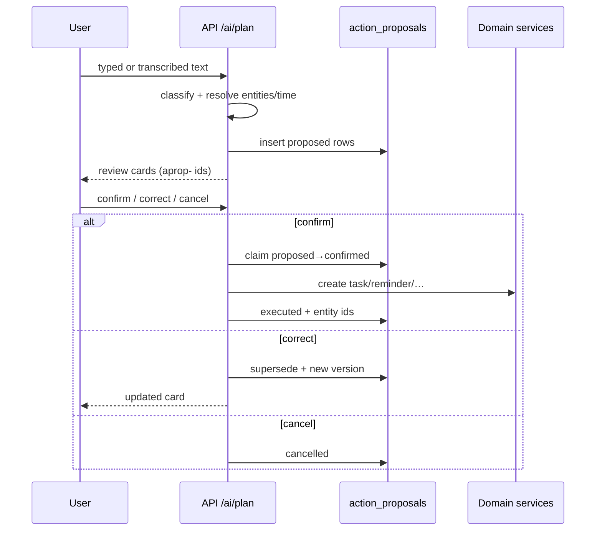

# Voice First — Event Flow

**Date:** 2026-07-31

```mermaid
sequenceDiagram
  participant U as User
  participant API as API /ai/plan
  participant P as action_proposals
  participant D as Domain services

  U->>API: typed or transcribed text
  API->>API: classify + resolve entities/time
  API->>P: insert proposed rows
  API-->>U: review cards (aprop- ids)
  U->>API: confirm / correct / cancel
  alt confirm
    API->>P: claim proposed→confirmed
    API->>D: create task/reminder/…
    API->>P: executed + entity ids
  else correct
    API->>P: supersede + new version
    API-->>U: updated card
  else cancel
    API->>P: cancelled
  end
```

Idempotency: re-confirming an `executed` proposal returns the same `entityType`/`entityId` without a second write.
